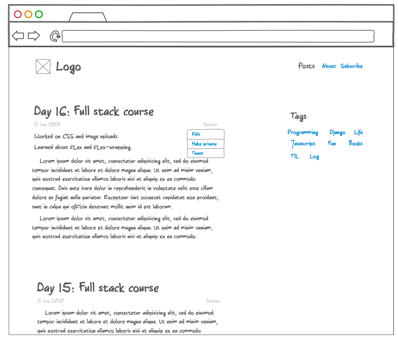
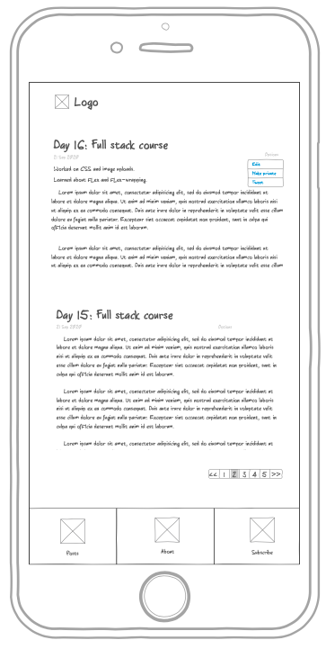

# Week 3

Nice! We can write small blog posts now. And we can quickly deploy the updates.

Starting using your project as a daily journal. Post updates about daily progress. Using your project yourself will make it usable.

---

## Task 1

_~3 days_

### Allow images uploads in posts

You will ultimately use the blog posts only if it is easy to upload pictures. Allow Basecamp type image uploading. Add ability to drop an image and it uploads and inserts in the rich text editor. Can move to [Trix](https://trix-editor.org) for now.

### Resources

- [Media files in Django](https://docs.djangoproject.com/en/3.1/topics/files/): It tells how to save and link to user uploaded media files. We might not need to "use files in models" but use it to create a simple upload API.
- [Tips for writing good functions](./samples/functions.md): Few tips on writing good functional code.
- [Trix Rich Text Editor](https://github.com/basecamp/trix): Replace our own `contenteditable` component with Trix. Trix already has JS support for handling image drops.
- [Example of image uploads](https://trix-editor.org/js/attachments.js): We will create our own Django API instead of using Cloudfront in example.

---

## Task 2

_~3 days_

We want to make the website responsive such that it looks like this on desktop and mobile.

### On desktop

**Things to note**

- Navigation menu on the right
- The posts have an options dropdown menu. It provides options for sharing and editing the post.
- The sidebar with tags section. There is 16px "gutter-space" between tags.

### On mobile

**Things to note**

- The navigation is shown as tabs on small devices.
- The sidebar can be hidden. Or better, try to show it below the posts on mobile devices.

### Resources

Will recommend you to create a account on [Codepen](http://codepen.io). Practice different layouts on a [basic canvas](https://codepen.io/faltoo/pen/XWdvjQv).

- [CSS Basics](https://developer.mozilla.org/en-US/docs/Learn/Getting_started_with_the_web/CSS_basics): Brush up the basics.
- [Using media queries and flex for responsive layouts](./samples/flex-responsive-trick.md): A small guide on how to use `flex` and `media-queries` to create responsive interfaces.
- [Flex Cheatsheet](https://css-tricks.com/snippets/css/a-guide-to-flexbox/): Overview of flex and quick reference guide.
- [Mastering Flex](https://developer.mozilla.org/en-US/docs/Web/CSS/CSS_Flexible_Box_Layout/Mastering_Wrapping_of_Flex_Items): I love the tricks on this page. It tells how to handle gutter spaces. How wrapping works.
- [Functional CSS](./samples/good-css.md): How to think when creating new CSS classes.
